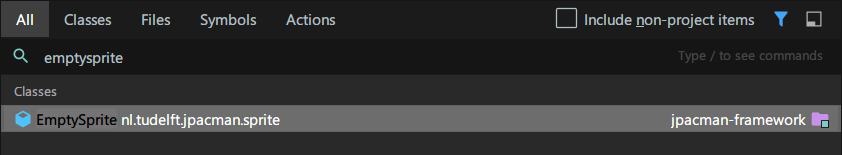
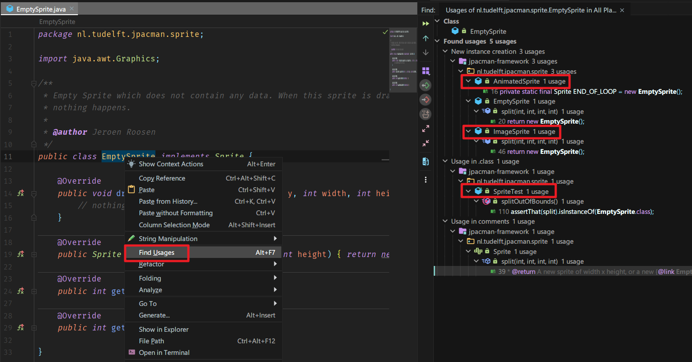
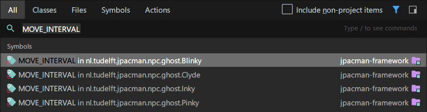
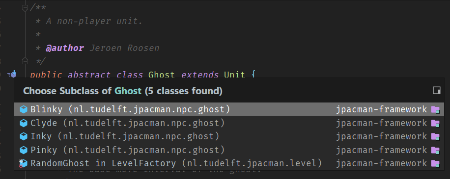
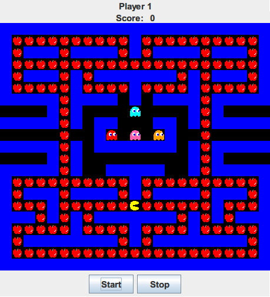
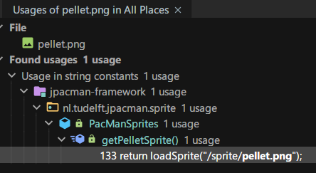
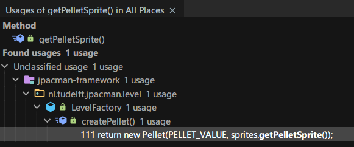
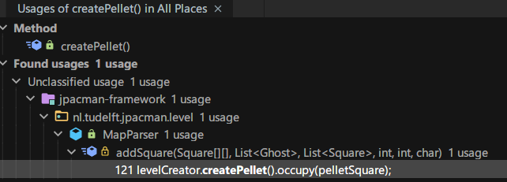
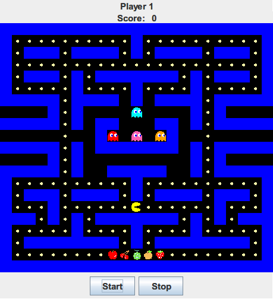

# Continue to explore JPacman

## Info

- Author: Junxian Chen
- Date: Jan. 21, 2020

## Assignment

Continue to explore JPacMan3 by answering the following questions:

### Q1: What is the role of EmptySprite

**Conclusion:**

1. It serves as the end of loop of an `AnimatedSprite`.
2. It serves as the default value when an invalid region is given for the splitting process.

**Steps:**

1. Open the `jpacman3` project with IntelliJ IDEA, then hit the shift key twice and type `EmptySprite` in the dialog to locate `EmptySprite.java`.

   

2. Read `EmptySprite.java`. From the comment we can tell `EmptySprite` is a type of sprite that draws nothing on the screen. From the code we know that its width and height are both 0. But what is the purpose of designing this?

    ```java
    package nl.tudelft.jpacman.sprite;

    import java.awt.Graphics;

    /**
    * Empty Sprite which does not contain any data. When this sprite is drawn,
    * nothing happens.
    *
    * @author Jeroen Roosen
    */
    public class EmptySprite implements Sprite {

        @Override
        public void draw(Graphics graphics, int x, int y, int width, int height) {
            // nothing to draw.
        }

        @Override
        public Sprite split(int x, int y, int width, int height) {
            return new EmptySprite();
        }

        @Override
        public int getWidth() {
            return 0;
        }

        @Override
        public int getHeight() {
            return 0;
        }

    }
    ```

3. In order to know more about the role of `EmptySprite`, we may use the function 'Find Usages' provided by IntelliJ IDEA.

   

   As we can see here, `EmptySprite` has 5 usages across the project in total.

4. So let's start with `AnimatedSprite`. The class `AnimatedSprite` has a field named `END_OF_LOOP`, whose value equals to an `EmptySprite` object. So we can guess that the end of loop for an `AnimatedSprite` is an `EmptySprite`. Digging deeper, the field `END_OF_LOOP` has only 1 usage, which is located in the `currentSprite` method. This method returns the frame of the current index of an `AnimatedSprite`. In the method it assigns an `EmptySprite` to the result, so if the current index is not within the length of animation frames, it will be the end of the loop.

    ```java
    /**
    * Animated sprite, renders the frame depending on the time of requesting the
    * draw.
    *
    * @author Jeroen Roosen
    */
    public class AnimatedSprite implements Sprite {

        /**
        * Static empty sprite to serve as the end of a non-looping sprite.
        */
        private static final Sprite END_OF_LOOP = new EmptySprite();

    ```

    ```java
    /**
     * @return The frame of the current index.
     */
    private Sprite currentSprite() {
        Sprite result = END_OF_LOOP;
        if (current < animationFrames.length) {
            result = animationFrames[current];
        }
        assert result != null;
        return result;
    }
    ```

5. Then let's have a look at `ImageSprite`. `ImageSprite` is a sprite that is made of only a static image. It has 1 usage of `EmptySprite` in its method `split`. Here `split` receives 4 parameters, which can be used for representing the dimension of an image. The method `split` first makes sure the given portion of the image is within the original image. If the parameters are valid, then it does the splitting and return a new `ImageSprite`, or else, it does nothing and returns an `EmptySprite`.

    ```java
    /**
    * Basic implementation of a Sprite, it merely consists of a static image.
    *
    * @author Jeroen Roosen
    */
    public class ImageSprite implements Sprite
    ```

    ```java
    @Override
    public Sprite split(int x, int y, int width, int height) {
        if (withinImage(x, y) && withinImage(x + width - 1, y + height - 1)) {
            BufferedImage newImage = newImage(width, height);
            newImage.createGraphics().drawImage(image, 0, 0, width, height, x,
                y, x + width, y + height, null);
            return new ImageSprite(newImage);
        }
        return new EmptySprite();
    }
    ```

6. Finally, the last usage of `EmptySprite` lies in `SpriteTest`. In the test, a 64x64 sprite is loaded. There is a sub-test that gives parameters which indicate an invalid split, resulting an `EmptySprite` should be returned. As written in the base class `Sprite.java`, if the region is not in the current sprite then a new `EmptySprite` will be returned.

    ```java
    public class SpriteTest {

    private Sprite sprite;
    private SpriteStore store;

    private static final int SPRITE_SIZE = 64;
    ```

    ```java
    /**
     * Verifies that a split that isn't within the actual sprite returns an empty sprite.
     */
    @Test
    public void splitOutOfBounds() {
        Sprite split = sprite.split(10, 10, 64, 10);
        assertThat(split).isInstanceOf(EmptySprite.class);
    }
    ```

    ```java
    /**
     * Returns a portion of this sprite as a new Sprite.
     *
     * @param x
     *            The x start coordinate.
     * @param y
     *            The y start coordinate.
     * @param width
     *            The width of the target sprite.
     * @param height
     *            The height of the target sprite.
     * @return A new sprite of width x height, or a new {@link EmptySprite} if
     *         the region was not in the current sprite.
     */
    Sprite split(int x, int y, int width, int height);
    ```

### Q2: What is the role of MOVE_INTERVAL and INTERVAL_VARIATION

**Conclusion:**

They define the frequency of a `Ghost`'s movement.

**Steps:**

1. Repeat the first step as we did in Q1. The results are shown below.

   

   

   Interestingly, both of these 2 constants appear in the same files, and these files are all some kinds of ghost, judging from their package names. It makes me wonder it must have something to do with the `Ghost` class. To verify this, I navigated to the `Ghost.java` file and found that `Blinky`, `Clyde`, `Inky` and `Pinky` are all subclasses of `Ghost`. So these 2 properties must be something in common being a `Ghost`.

   

2. I examined `Ghost.java` and found 2 variables named `moveInterval` and `intervalVariation`, in contrast of `MOVE_INTERVAL` and `INTERVAL_VARIATION`. So I assumed `MOVE_INTERVAL` and `INTERVAL_VARIATION` are special values for different types of `Ghost`, specified seperately in their own files. So my goal here is to figure out what `moveInterval` and `intervalVariation` are.
   By looking up the usages of the `moveInterval` variable, I found there is only 1 usage inside the `getInterval` method. Together with `intervalVariation`, they form the base of the interval between the moves of a `Ghost`. In this case, `moveInterval` is the base value of the interval while `intervalVariation` adds some increments ranged from 0 to `intervalVariation`, ie. ```[0, intervalVariation)```.

   ```java
   /**
    * A non-player unit.
    *
    * @author Jeroen Roosen
    */
   public abstract class Ghost extends Unit {
      /**
      * The sprite map, one sprite for each direction.
      */
      private final Map<Direction, Sprite> sprites;

      /**
      * The base move interval of the ghost.
      */
      private final int moveInterval;

      /**
      * The random variation added to the {@link #moveInterval}.
      */
      private final int intervalVariation;
   ```

   ```java
    /**
     * The time that should be taken between moves.
     *
     * @return The suggested delay between moves in milliseconds.
     */
    public long getInterval() {
        return this.moveInterval + new Random().nextInt(this.intervalVariation);
    }
   ```

### Q3: If you wanted to add a fruit, which files would you need to change

**Method 1:**

To achieve this, the simplest way is to replace something already exists with any fruit sprite. For example, in `PacManSprites.java`, you may change

```java
    public Sprite getPelletSprite() {
        return loadSprite("/sprite/pellet.png");
    }
```

to

```java
    public Sprite getPelletSprite() {
        return loadSprite("/sprite/apple.png");
    }
```

And you will get apples on the board instead of normal pellets.



**Method 2:**

If we want to add some fruit without modifying existing code, we will have to do something more than replacing. Now we want to know how a pellet is loaded in the game, so the most intuitive option for us to start is to find usages of `pellet.png`.

1. Find usages of `pellet.png`.

   

2. Find usages of `getPelletSprite()`

   

3. Find usages of `createPellet()`

   

4. In `MapParser.java`, we can find a method called `addSquare`. This method can be easily understood. It receives a `char` type param `c` and accord to that, it adds different square to the `grid`.

   ```java
    /**
     * Adds a square to the grid based on a given character. These
     * character come from the map files and describe the type
     * of square.
     *
     * @param grid
     *            The grid of squares with board[x][y] being the
     *            square at column x, row y.
     * @param ghosts
     *            List of all ghosts that were added to the map.
     * @param startPositions
     *            List of all start positions that were added
     *            to the map.
     * @param x
     *            x coordinate of the square.
     * @param y
     *            y coordinate of the square.
     * @param c
     *            Character describing the square type.
     */
    protected void addSquare(Square[][] grid, List<Ghost> ghosts,
                             List<Square> startPositions, int x, int y, char c) {
        switch (c) {
            case ' ':
                grid[x][y] = boardCreator.createGround();
                break;
            case '#':
                grid[x][y] = boardCreator.createWall();
                break;
            case '.':
                Square pelletSquare = boardCreator.createGround();
                grid[x][y] = pelletSquare;
                levelCreator.createPellet().occupy(pelletSquare);
                break;
            case 'G':
                Square ghostSquare = makeGhostSquare(ghosts, levelCreator.createGhost());
                grid[x][y] = ghostSquare;
                break;
            case 'P':
                Square playerSquare = boardCreator.createGround();
                grid[x][y] = playerSquare;
                startPositions.add(playerSquare);
                break;
            default:
                throw new PacmanConfigurationException("Invalid character at "
                    + x + "," + y + ": " + c);
        }
    }
   ```

5. Now try to add some code to this method. We have lots of png files for fruit, which are apple, cherry, melon, orange, and strawberry. To add all these to the game, first we can add a few cases to the switch clause.

    ```java
            case 'A':
                Square appleSquare = boardCreator.createGround();
                grid[x][y] = appleSquare;
                levelCreator.createApple().occupy(appleSquare);
                break;
            case 'C':
                Square cherrySquare = boardCreator.createGround();
                grid[x][y] = cherrySquare;
                levelCreator.createCherry().occupy(cherrySquare);
                break;
            case 'M':
                Square melonSquare = boardCreator.createGround();
                grid[x][y] = melonSquare;
                levelCreator.createMelon().occupy(melonSquare);
                break;
            case 'O':
                Square orangeSquare = boardCreator.createGround();
                grid[x][y] = orangeSquare;
                levelCreator.createOrange().occupy(orangeSquare);
                break;
            case 'S':
                Square strawberrySquare = boardCreator.createGround();
                grid[x][y] = strawberrySquare;
                levelCreator.createStrawberry().occupy(strawberrySquare);
                break;
    ```

6. Then add these methods into `LevelFactory.java`.

    ```java
    public Pellet createApple() {
        return new Pellet(PELLET_VALUE + 1, sprites.getAppleSprite());
    }

    public Pellet createCherry() {
        return new Pellet(PELLET_VALUE + 2, sprites.getCherrySprite());
    }

    public Pellet createMelon() {
        return new Pellet(PELLET_VALUE + 3, sprites.getMelonSprite());
    }

    public Pellet createOrange() {
        return new Pellet(PELLET_VALUE + 4, sprites.getOrangeSprite());
    }

    public Pellet createStrawberry() {
        return new Pellet(PELLET_VALUE + 5, sprites.getStrawberrySprite());
    }
    ```

7. Then add these methods into `PacManSprites.java`.

   ```java
    public Sprite getAppleSprite() {
        return loadSprite("/sprite/apple.png");
    }

    public Sprite getCherrySprite() {
        return loadSprite("/sprite/cherry.png");
    }

    public Sprite getMelonSprite() {
        return loadSprite("/sprite/melon.png");
    }

    public Sprite getOrangeSprite() {
        return loadSprite("/sprite/orange.png");
    }

    public Sprite getStrawberrySprite() {
        return loadSprite("/sprite/strawberry.png");
    }
   ```

8. Finally add the fruit code (A, C, M, O, S) to the `board.txt`.

   ```text
    #######################
    #..........#..........#
    #.###.####.#.####.###.#
    #.....................#
    #.###.#.#######.#.###.#
    #.....#....#....#.....#
    #####.#### # ####.#####
        #.#    G    #.#
    #####.# ##   ## #.#####
        .  #G G G#  .
    #####.# ####### #.#####
        #.#         #.#
    #####.#  #####  #.#####
    #..........#..........#
    #.###.####.#.####.###.#
    #...#......P......#...#
    ###.#.#.#######.#.#.###
    #.....#....#....#.....#
    #.########.#.########.#
    #........ACMOS........#
    #######################
   ```

9. Run the game and the fruit appears.

   

## Submit

- Create a pull request containing *only* your assignment.
- The assignment should be located in the *homework/jpacman_answers* directory
- Deadline: **Wednesday (January 22nd) at 3pm**
