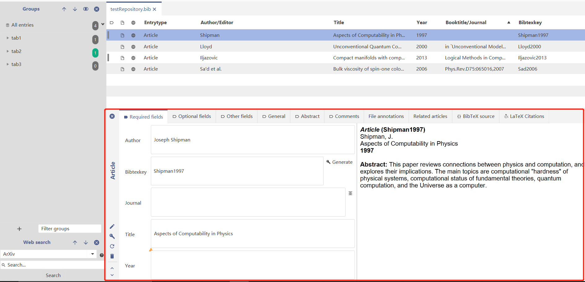

Issue description:

<https://github.com/JabRef/jabref/issues/5847>

Our project is a reference management software called "JabRef". For each entry, there is an entry editor panel where users could edit the fields (See figure 1). 

​                                                                               *Figure 1: Entry editor*

Most entries are under a specific reference format called "Bibtex". However, the entry field doesn't have any tips about what kind of rules the input should follow. For example, for the "Author" field, if there are multiple authors, the format should be "author1 and author2", the separator should be "and" instead of "," or whitespace. Without any tips, users may easily input some wrong formats which could cause some potential errors.

One way to fix this problem is to add different tips for different fields. When mouse is hovering over the field title, a tip will show up to tell users what kind of format user should follow for this field. Besides, the tips should not be casual, there is an official document explaining the details about formats for "Bibtex" file type. 

<http://mirror.kumi.systems/ctan/biblio/bibtex/base/btxdoc.pdf>

